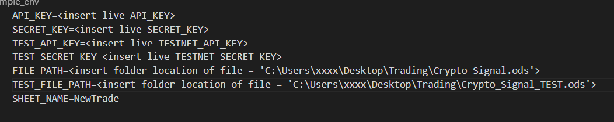
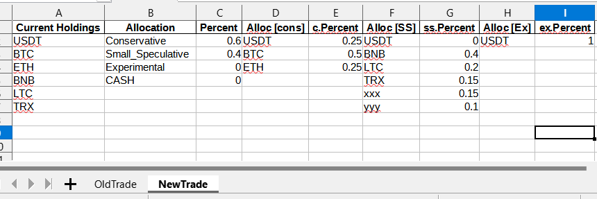
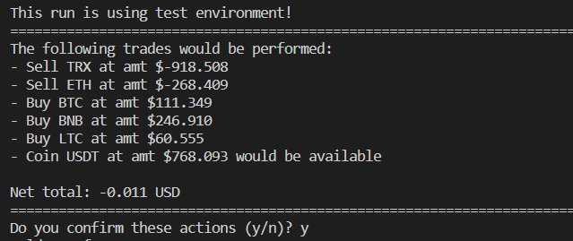
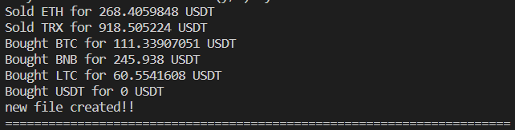

# PyBOT_BinanceSignal

v1.0
Automate performing rebalancing of your assets on binance using LibreOffice Calc (.ods)

## Install

Download and install IDE, Python & GIT (if you don't have yet):

- VSCode [here](https://code.visualstudio.com/download)
- Python [here](https://www.python.org/downloads/)
- GIT [here](https://git-scm.com/downloads)

Create your API Keys:

- Testnet [here](https://testnet.binance.vision/)
- Live Binance Key [here](https://www.binance.com/en/my/settings/api-management)

Clone the repository:

```sh
git clone https://github.com/SilverJRM/PyBOT_BinanceSignal.git
```

Install dependencies:

```sh
pip install -r requirements.txt
```

## Setup

Setup your env file:

- Test keys
- Live API keys
- Folder and file names
- SheetName where allocations would be read
  

Setup your allocation on your file:

- Current holdings = All the assets you want to include in the rebalancing
- Allocations/Percent = Percent allocation for each bucket
- Alloc (cons)/percent = Percent allocations for the Conservative Bucket
- Alloc (SS)/percent = Percent allocations for Small Speculative Bucket
- Alloc (Ex)/percent = Percent allocations for Experimental Bucket
- NewTrade = SheetName where the allocations is pulled from
  

## Run Scripts

run script (test) to get all assets on testnet on command line:

```sh
py .\test_allassets.py
```

run script (test - hardcoded) on command line:

```sh
py .\test_main.py
```

run main script (test mode) on command line:

```sh
py .\main.py
```

run main script (live mode) on command line:

```sh
py .\main.py --test n
```

## Screenshot

When you run script it would produce a summary of trades to be done and you need to confirm before it is performed:



After confirmation:



## Contribution

Suggestions and PRs are welcome!

Please create issue or open PR request for contribution.

## Donate

If this script helped you out feel free to donate.

- BTC: bc1qx3nk39z8h3nuu03n4k6cazpss4hy6wl9vmd7w6
- ETH: 0x7Fe9cB61661fCccF112e2ECe93605e1A5D96d4C6
- ADA/Cardano: addr1qxnq7tgffqka5fmsphstmnkjzm485dx3sxhd0m4svx9gcx9xgr9y8ursyep05fs8p6067tut4485ak666lhkw5nn8l3seaad4u
